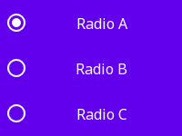

# Pano

Pano is a library for building graphical user interfaces.

## App

An App is the orchestrator which manages the main loop, events, and windows.

## Window

A Window is the element which displays the GUI.

## View

A View is a visual element which comprises the UI.

### Significance

A View's Significance provides semantic information about the View, influencing how it should be rendered and interacted with.

For example, a button which performs the primary action of the interface should be rendered differently from a normal button. Similarly, a button which performs a destructive action, such as deleting an account, should be rendered in a way that conveys the danger to the user.

### Condition

A View's Condition provides state information about the View, influencing how it should be rendered and interacted with.

For example, a button should be rendered differently depending on whether it is enabled or disabled, or whether it is currently activated.

## Layout

A Layout is responsible for positioning and sizing views to structure the UI.

Pano includes several layouts for constructing interfaces, try them out by running the [Layout Sample App](./samples/layouts/)

### Edge

An Edge Layout arranges views along each of the four edges.

### Frame

A Frame Layout decorates a view with a Border, Padding, and/or a Margin.

### Grid

A Grid Layout arranges views in a two dimensional grid.

### Stack

A Stack Layout arranges views along a given axis.

### Tab

A Tab Layout enables multiple views to be grouped and navigated.

## Widget

A Widget is a view that the user can interact with.

Pano includes several widgets to enable interactions, try them out by running the [Widget Sample App](./samples/widgets/)

### Button


A Button enables an action to be triggered when activated.

### CheckBox


A CheckBox enables an option to be checked.

### RadioButton


A RadioButton enabled an option to be selected.

### RadioGroup



A RadioGroup is a set of RadioButtons that operate with mutual exclusivity.

## Text

Pano includes support for rendering and interacting with text with the TextView and TextEdit widgets respectively.

Try them out by running the [Text Sample App](./samples/text/)

### Text Alignment

- Vertical - Start, Center, End
- Horizontal - Start, Center, End, Justified

Start and End in this case is determined by the direction of the font used.

### Text Truncation

- None - text is not truncated, and the view will be made large enough to display all the text.
- Clip - text is truncated if it cannot fit in the available space.
- Ellipsis - text is truncated and an ellipsis is added if it cannot fit in the available space.

### Text Wrapping

- None - text is not wrapped, and the view will be made large enough to display all the text.
- Character - text is wrapped at the character boundary.
- Word - text is wrapped at the word boundary, or a hyphen is added if a word must be broken.

## Repository Layout

 - include: header files
 - src: source code files
 - test/include: test header files
 - test/src: test code files
 - color: color schemes
 - font: embedded fonts
 - icon: embedded icons
 - sample: sample code

## Dependencies

Pano is built on top of [SDL](https://www.libsdl.org).

### MacOS

- brew install sdl3 sdl3_image sdl3_ttf

## Supported Platforms

### Build Platforms

The following list shows the currently supported build platforms.

 - MacOS (Tahoe)

### Target Platforms

The following list shows the currently supported target platforms.

 - MacOS (Tahoe)

### Cross Compatibility

The following matrix shows which buld/run combinations are supported and verified.

```
         |  MacOS  |  Linux  | Android |   iOS
---------+---------+---------+---------+---------
  MacOS  |    Y    |         |         |
  Linux  |         |         |         |
```

## Build

```cmake
cmake -S . -B build
cmake --build build
```

## Test

```
ctest --test-dir build
ctest --test-dir build -R SpecificTest
```

## Installation

```
cmake --install build
```

# Usage

```
using namespace Pano;

int main(int argc, char* argv[]) {
  App app;
  app.SetColorProvider(CreateLightMaterialColorProvider());
  app.SetFontProvider(CreateNotoSansProvider());
  app.SetIconProvider(CreateMaterialIconProvider());

  TextView text_view{"Hello World!"};

  Window window{"Pano App"};
  window.SetContent(&text_view);
  window.SetVisible(true);

  app.Start();
  return 0;
}
```
